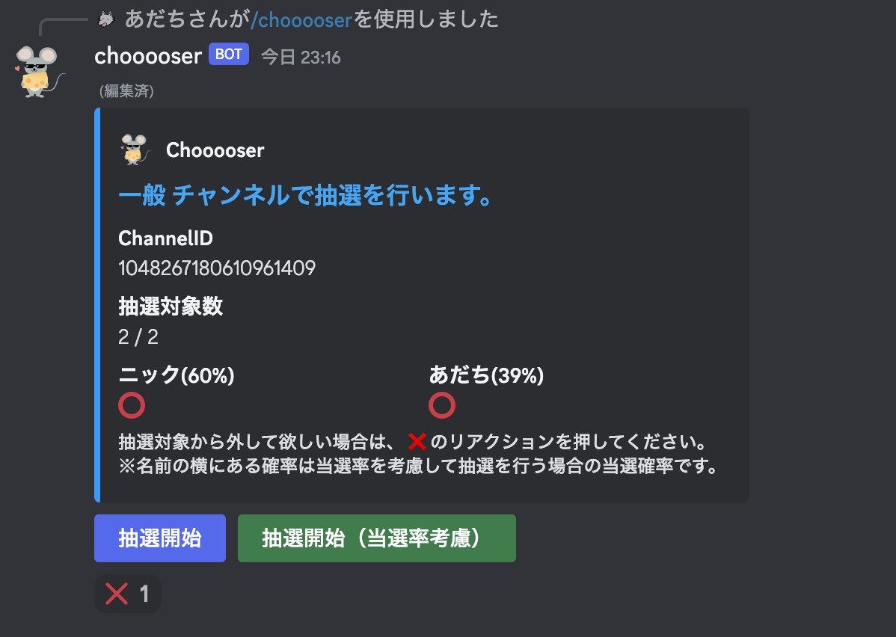
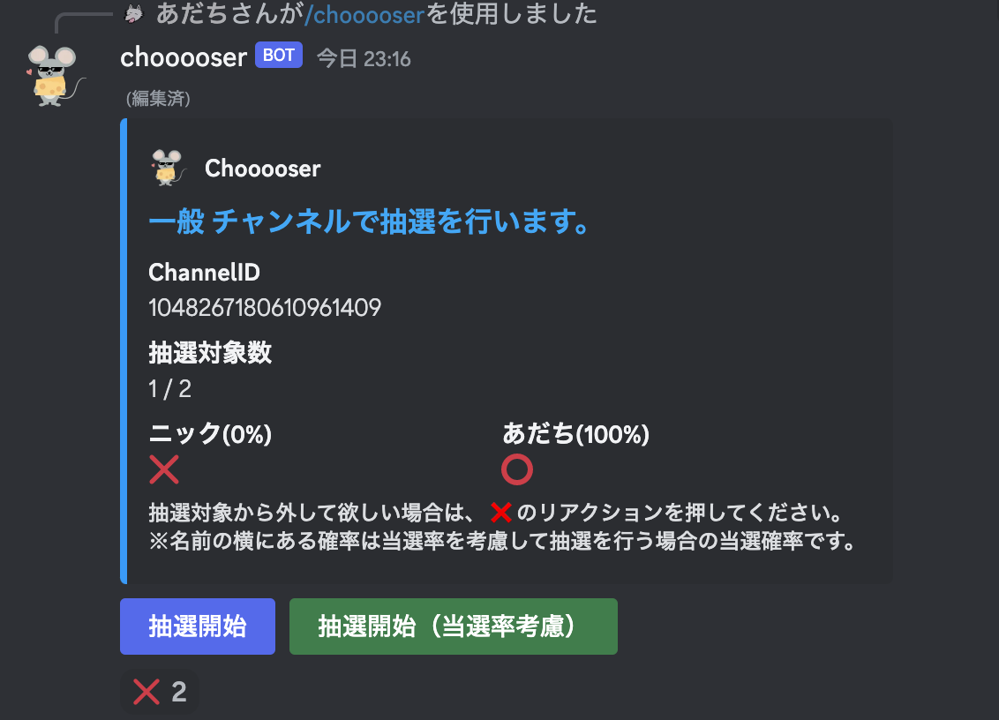

# Discord Chooooser

自分が入室しているボイスチャンネルのメンバーをランダムで選ぶ Bot です。

## Bot をサーバーに招待

- 次の URL にアクセスして、追加したいサーバーを選択してください。

https://discord.com/api/oauth2/authorize?client_id=1046364323951431700&permissions=0&scope=bot%20applications.commands

## 使い方

### シンプルな抽選

1. 任意のボイスチャンネルに入室
2. 任意のテキストチャンネルに `@chooooser` とメンション付きでメッセージを送信
3. メンションメッセージを送信した人が入室しているボイスチャンネルの入室中メンバ内から、ランダムで 1 人選ばれます。
  

### 高度な抽選

1. 任意のボイスチャンネルに入室
2. 任意のテキストチャンネルに `/chooooser` とコマンドのメッセージを送信
3. 埋め込みメッセージがテキストチャンネルに投稿される
   
4. 抽選対象から自身を除外させる場合は、❌ のリアクションをする。
   
5. `抽選開始`ボタンを押下すると、⭕️ のメンバ内から、ランダムで 1 人選ばれます。
   
6. `抽選開始（当選率考慮）`ボタンを押下すると、コマンドを実行したテキストチャンネルで直近100件のメッセージ内から、抽選結果メッセージを収集し、当選率が高い人は低く、当選率が低い人は高い確率で、当選者が選出され、`抽選開始`ボタン同様に 1 人選ばれます。
    - 当選率の計算方法
      - `(1 + 総抽選回数 - 当選数) / (合計非当選回数 + 参加人数)`
      - ※名前横にこの公式で求められた当選率が表示されます。
7. 連続してコマンドを送信するか、全員がボイスチャンネルから退出すると、抽選は終了します。（連続してコマンドを送信した場合は、古い抽選が終了します。
   

### トラブルシューティング

#### メンションやコマンドメッセージを送信しても応答しない場合

- `chooooser`が**オンライン**であることを確認してください。

#### `chooooser`がオンラインなのに応答しない場合

- メッセージを送信したテキストチャンネルで、 `chooooser`はメッセージを送信する権限が無い可能性があります。
- テキストチャンネルがプライベートチャンネルの場合、テキストチャンネルへ`chooooser`を**招待**させてください。
